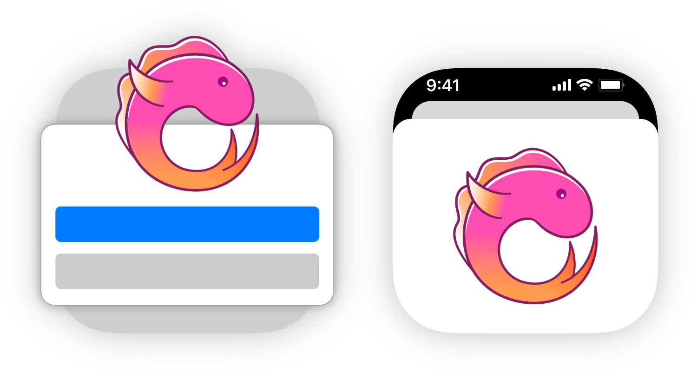
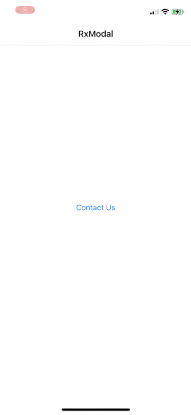

<p align="center">

<br />
<a href="https://cocoapods.org/pods/RxModal" alt="RxModal on CocoaPods" title="RxModal on CocoaPods"></a>
<a href="https://github.com/apple/swift-package-manager" alt="RxModal on Swift Package Manager" title="RxModal on Swift Package Manager"></a>
</p>

# RxModal

**RxModal** enforces the simple idea that a modal flow can be considered as a simple asynchroneous event:
- the view controller is presented on subscribe
- the user do what they want to do in the modal view
- the view controller is dismissed on dispose and eventually emit a value or an error

# Usage

<table>
  <tr>
    <th width="30%">Here's an example</th>
    <th width="30%">In Action</th>
  </tr>
  <tr>
  <td><pre lang="swift">
  let mailComposer = RxModal.mailComposer {
      $0.setToRecipients([
          "rxmodal@rxswiftcommunity.org"
      ])
      $0.setMessageBody(
          "Hello World!",
          isHTML: false
      )
  }
  let messageComposer = RxModal.messageComposer {
      $0.recipients = ["0639981337"]
      $0.body = "Hello World!"
  }
  contactUsButton
      .rx.tap
      .flatMapFirst { [unowned contactUsButton] in
          RxModal.actionSheet(
              source: .bounds(contactUsButton),
              actions: [
                  .default(
                      title: "Mail",
                      flatMapTo: mailComposer
                  ),
                  .default(
                      title: "Message",
                      flatMapTo: messageComposer
                  ),
                  .cancel(title: "Cancel")
              ])
      }
      .subscribe()
      .disposed(by: disposeBag)
    </pre>
    </td>
    <td>
    
    </td>
  </tr>
</table>

# Supported Modals

```swift
// MFMailComposeViewController
RxModal.mailComposer() -> Single<MFMailComposeResult>

// MFMessageComposeViewController
RxModal.messageComposer() -> Single<MessageComposeResult>

// MPMediaPickerController
RxModal.mediaPicker() -> Single<MPMediaItemCollection>

// PHPickerViewController
RxModal.photoPicker() -> Single<[PHPickerResult]>

// ASWebAuthenticationSession
RxModal.webAuthenticationSession(url:callbackURLScheme:) -> Single<URL>

// UIAlertController
RxModal.alert<T>(title:message:textFields:actions:) -> Observable<T>
RxModal.actionSheet<T>(source:title:message:actions:) -> Observable<T>
```

### Presenter

All these functions also include a `presenter: Presenter` argument that allows you to choose where the modal will be presented. 
Presenters are just lazy `UIViewController` getters: 
```swift
.viewController(_:) -> $0
.view(_:) -> $0.window?.rootViewController
.window(_:) -> $0.rootViewController 
.scene(_:) -> $0.windows.first?.rootViewController
.keyWindow -> UIApplication.shared.keyWindow?.rootViewController
```
Default is `.keyWindow`. On iPad or macCatalyst allowing multiple windows, we discourage you to use `.keyWindow` or `.scene(_:)` as it might select the wrong window.

### Configuration 

These functions also include a configuration closure : `(ViewController) -> Void` that will let you configure the view controller before presentation.

If a modal requires some parameters at `init` time, they will be part of the `RxModal` function (ex: `ASWebAuthenticationSession`, `UIAlertController`).

### Preconditions

Some RxModals perform precondition checks before presenting the modal and emit a `RxModalError.unsupported` if they aren't fulfilled:
- `RxModal.mailComposer()` → `MFMailComposeViewController.canSendMail()`
- `RxModal.messageComposer()` → `MFMessageComposeViewController.canSendText()`

Some RxModals perform an authorization status check before presenting the modal and either request authorization, or emit a `RxModalError.authorizationStatusDenied(Any)` if authorization is denied:
- `RxModal.mediaPicker()` → `MPMediaLibrary.authorizationStatus()`

### Dialogs

`RxModal.alert()` and `RxModal.actionSheet()` allows you to define actions that are converted to a new Observable stream, a value, or an error:
```swift
DialogAction<T>.default(title:flatMapTo: Observable<T>)
DialogAction<T>.default(title:mapTo: T) // == flatMapTo: Observable.just(T)
DialogAction<T>.default(title:throw: Error) // == flatMapTo: Observable.error(Error)
DialogAction<T>.default(title:) // == flatMapTo: Observable.empty()
```

`RxModal.alert()` also let you configure alert text fields:
```swift
RxModal.alert(
    title: "Sign in",
    message: "Please sign in using your credentials",
    textFields: [
        DialogTextField.email { $0.placeholder = "e-mail" },
        DialogTextField.password { $0.placeholder = "password" }
    ],
    actions: [
        .cancel(title: "Cancel"),
        .default(title: "Sign In") { textFields in
            Credentials(
                email: textFields[0].text ?? "",
                password: textFields[1].text ?? ""
            )
        },
    ]
)
```

# Extending RxModal

You can easily extend RxModal with your own controllers / modal flows.

If your controller is already returning its output using Rx, it's easy:
```swift
class MyModalViewController: UIViewController {
    let myResult = PublishSubject<MyResult>()
    // ...
}

extension RxModal {
    func myModal(
        presenter: Presenter = .keyWindow,
        configuration: @escaping (MyModalViewController) -> Void
    ) -> Single<MyResult> {
        RxModalCoordinator<MyModalViewController>.present(using: presenter) { _ in
            let modal = MyModalViewController()
            configuration(modal)
            return modal
        } sequence: {
            $0.viewController.myResult.asSingle()
        }
    }
}
```

If your controller is rather using a traditional `delegate` approach, you'll need to subclass `RxModalCoordinator`:

```swift
protocol MyModalViewControllerDelegate: AnyObject {
    func myModal(_ myModal: MyModalViewController, didFinishWith result: MyResult)
    func myModal(_ myModal: MyModalViewController, didFinishWithError error: Error)
}

class MyModalViewController: UIViewController {
    weak var delegate: MyModalViewControllerDelegate?
    // ...
}

extension RxModal {
    func myModal(
        presenter: Presenter = .keyWindow,
        configuration: @escaping (MyModalViewController) -> Void
    ) -> Single<MyResult> {
        
        MyModalViewControllerCoordinator.present(using: presenter) { coordinator in
            let modal = MyModalViewController()
            modal.delegate = coordinator
            configuration(modal)
            return modal
        } sequence: {
            $0.myResult.asSingle()
        }
        
    }
}

final class MyModalViewControllerCoordinator: RxModalCoordinator<MyModalViewController>, MyModalViewControllerDelegate {
    required init(){}
    
    let myResult = PublishSubject<MyResult>()
    
    func myModal(_ myModal: MyModalViewController, didFinishWith result: MyResult) {
        myResult.onNext(result)
        myResult.onCompleted()
    }
    
    func myModal(_ myModal: MyModalViewController, didFinishWithError error: Error) {
        myResult.onError(error)
    }

}
```

If your controller is embedded in a non `UIViewController` object, you won't be able to leverage on `RxModalCoordinator` and you'll need to handle all the present/dismiss boilerplate. See [ASWebAuthenticationSession.swift](./Sources/Other/ASWebAuthenticationSession.swift) as an example.


# Author

[Jérôme Alves](https://twitter.com/jegnux)

# License

**RxModal** is available under the MIT license. See the [LICENSE](LICENSE) file for more info.
